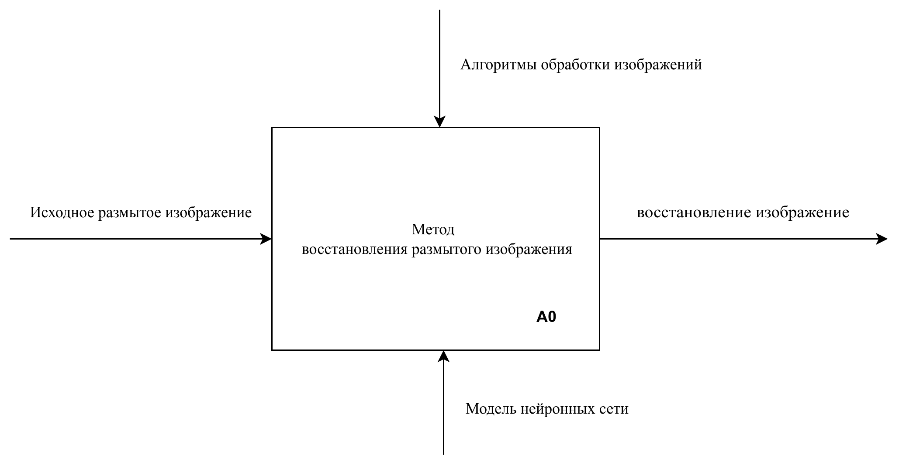
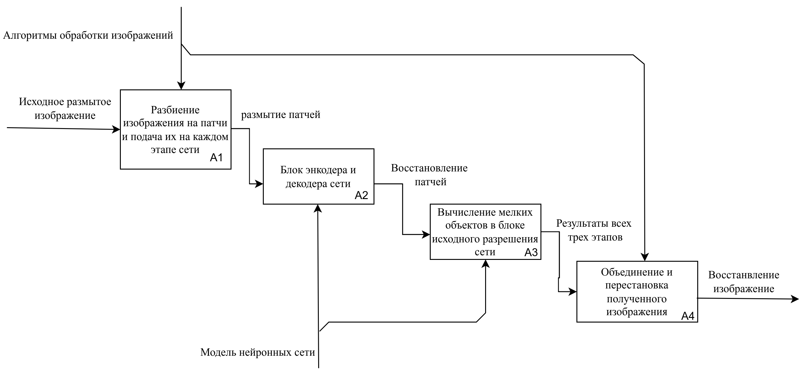
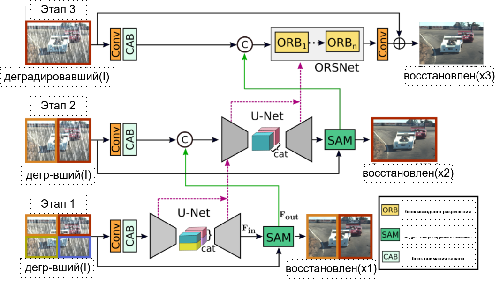
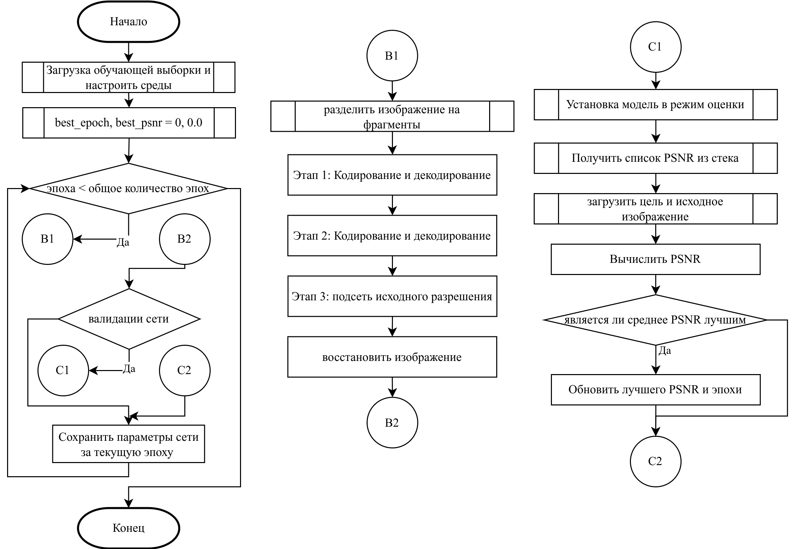
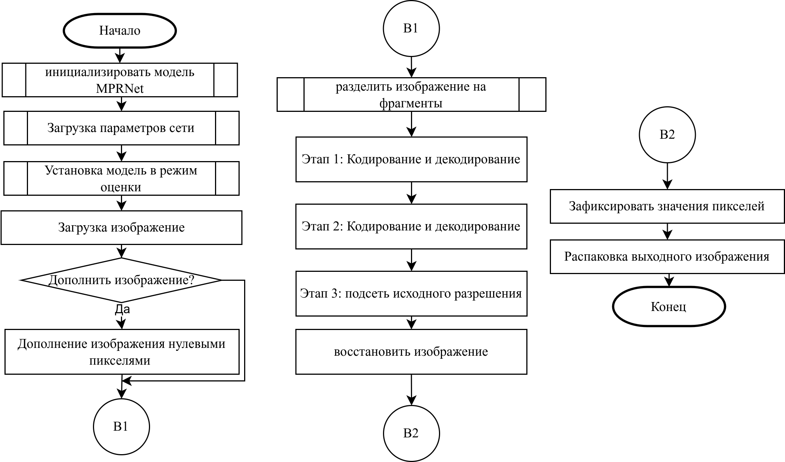
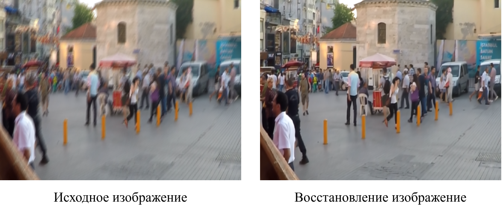

<!-- header: "Московский государственный технический университет
имени Н. Э. Баумана   (национальный исследовательский университет)" -->

## Выпускная квалификационная работа бакалавра

 

# «Метод устранения размытия изображений человека на фоне природы с применением нейронных сетей»

 

### _Студент: Ахмад Халид Каримзай ИУ7и-84Б_

### _Научный руководитель: А.С. Кострицкий_

<!-- МГТУ им.  -->

---

<!-- header: "" -->
<!-- footer: "" -->

## <!-- paginate: true -->

## Цель и задачи работы

Целью данной выпускной квалификационной работы является разработка метода устранения размытия изображений человека на фоне природы с применением нейронных сетей.

**Задачи**:

- Провести анализ существующих методов и алгоритмов, и выбрать подходящий для решения посатвленной задачи;
- Спроектировать метод устранения размытия изображений человека на фоне природы с применением нейронных сетей;
- Выбрать средства реализации разработанного метода;
- Провести анализ и оценку качества полученных результатов.
---

## Формализованная постановка задачи

---

## Сравнение существующих архитектур нейронных сетей

<table style="width:100%; border-collapse: collapse; text-align: center;">
    <thead>
        <tr>
            <th style="border: 1px solid black;"><strong>Критерий\Арх. нейросеть</strong></th>
            <th style="border: 1px solid black;"><strong>CNN</strong></th>
            <th style="border: 1px solid black;"><strong>ResNet</strong></th>
            <th style="border: 1px solid black;"><strong>CapsNets</strong></th>
        </tr>
    </thead>
    <tbody>
        <tr>
            <td style="border: 1px solid black; text-align: left;">Производительность</td>
            <td style="border: 1px solid black;"><strong>Высокая</strong></td>
            <td style="border: 1px solid black;">Ограниченная</td>
            <td style="border: 1px solid black;">Переменная</td>
        </tr>
        <tr>
            <td style="border: 1px solid black; text-align: left;">Устойчивость</td>
            <td style="border: 1px solid black;"><strong>Низкая</strong></td>
            <td style="border: 1px solid black;">Низкая</td>
            <td style="border: 1px solid black;">Высокая</td>
        </tr>
        <tr>
            <td style="border: 1px solid black; text-align: left;">Объем данных</td>
            <td style="border: 1px solid black;"><strong>Большой</strong></td>
            <td style="border: 1px solid black;">Средний</td>
            <td style="border: 1px solid black;">Меньший</td>
        </tr>
        <tr>
            <td style="border: 1px solid black; text-align: left;">Вычислительная эффективность</td>
            <td style="border: 1px solid black;"><strong>Высокая</strong></td>
            <td style="border: 1px solid black;">Низкая</td>
            <td style="border: 1px solid black;">Зависит от архитектуры</td>
        </tr>
    </tbody>
</table>

---

### Сравнение методов восстановления изображений на основе *CNN*

<table style="width:100%; border-collapse: collapse; text-align: center;">
      <thead>
          <tr>
              <td style="border: 1px solid black; text-align: left;"><b>Критерий\Метод</b></td>
              <th style="border: 1px solid black;"><b>DeblurGAN</b></th>
              <th style="border: 1px solid black;"><b>DMPHN</b></th>
              <th style="border: 1px solid black;"><b>MPRNet</b></th>
          </tr>
      </thead>
      <tbody>
          <tr>
              <td style="border: 1px solid black; text-align: left;">Точность восстановления мелких деталей</td>
              <td style="border: 1px solid black;">Высокая</td>
              <td style="border: 1px solid black;">Средняя</td>
              <td style="border: 1px solid black;"><b>Высокая</b></td>
          </tr>
          <tr>
              <td style="border: 1px solid black; text-align: left;">Адаптивность к различным уровням и типам размытия</td>
              <td style="border: 1px solid black;">Средняя</td>
              <td style="border: 1px solid black;">Средняя</td>
              <td style="border: 1px solid black;"><b>Высокая</b></td>
          </tr>
          <tr>
              <td style="border: 1px solid black; text-align: left;">Способность извлечения и обработки сложных функций изображения</td>
              <td style="border: 1px solid black;">Высокое</td>
              <td style="border: 1px solid black;">Среднее</td>
              <td style="border: 1px solid black;"><b>Высокое</b></td>
          </tr>
          <tr>
              <td style="border: 1px solid black; text-align: left;">Архитектура</td>
              <td style="border: 1px solid black;">Многоэтапная</td>
              <td style="border: 1px solid black;">Многоэтапная</td>
              <td style="border: 1px solid black;"><b>Многоэтапная</b></td>
          </tr>
      </tbody>
</table>

---

## Декомпозиция метода

---

## Архитектура нейронной сети

---

## Алгоритм обучения нейронной сети

---

## Алгоритм прогнозирования нейронной сети

---
## Средства реализации

 

  

Для программной реализации метода был использован язык программирования <strong>Python</strong>.

Для работы с нейронными сетями был использован библиотека <strong>Pytorch</strong>.

 

Для работы с изображениями был использован библиотека <strong>Pillow</strong>.

  

  

  

<!-- ### Обучение нейронной сети

- GoPro:
    - 2103 изображений;
    - 1111 изображений на валидацию;
### Обучение нейронной сети
- GoPto -->

---

## Исследование: метрики для сравнения

 

  

$$
	PSNR(I, \hat{I}) = 10 \cdot \log_{10} \left( \frac{R^{2}}{\frac{1}{N} \sum_{i=1}^{N} (I_{i} - \hat{I}_{i})^2} \right)
$$
  

  

$$
  SSIM(I, \hat{I}) = \frac{{2\mu_I \mu_{\hat{I}} + C_1}}{{\mu_I^2 + \mu_{\hat{I}}^2 + C_1}} \cdot \frac{2\sigma_I \sigma_{\hat{I}} + C_2}{\sigma_I^2 + \sigma_{\hat{I}}^2 + C_2}
$$
  

  

- $I$ - исходное изображение;
- $R$ - среднее значение яркости пикселя;
- $N$ - количество пикселей в изображении.

  

- $\hat{I}$ - предсказанное изображение;
- $\frac{\mu_{I}}{\sigma_{I}^2}$ и $\frac{\mu_{\hat{I}}}{\sigma_{\hat{I}}^2}$ - среднее/дисперсия значений пикселей;
- $C_1$ и $C_2$ - положительные константы, используемые для стабилизации деления.

  

---

## Исследование: корпусы данных

- **GoPro**:
    - 2,103 изб на *обучение*;
    - 1,111 изб на *валидацию*.
- **HIDE**:
    - 2,025 изб на *оценку*.
- **RealBlur**:
    - *RealBlur-J*:
        - 980 изб на *оценку*.
    - *RealBlur-R*:
        - 980 изб на *оценку*.

  

---

## Пример работы метода

---

<!-- ## Система обнаружения поддельного звука -->

## Исследование: сравнение с существующими методами

<table style="width:200%; border-collapse: collapse; text-align: center;">
    <caption><strong>Средние значения метрик относительно корпусов данных <i>GoPro</i>, <i>HIDE</i> и <i>RealBlur</i></strong></caption>
    <thead>
        <tr>
            <th rowspan="1" style="border: 1px solid black; background-color: white; border-left: none; border-top: none;"></th>
            <th colspan="2" style="border: 1px solid black;"><strong>GoPro</strong></th>
            <th colspan="2" style="border: 1px solid black;"><strong>HIDE</strong></th>
            <th colspan="2" style="border: 1px solid black;"><strong>RealBlur-R</strong></th>
            <th colspan="2" style="border: 1px solid black;"><strong>RealBlur-J</strong></th>
        </tr>
        <tr>
            <th style="border: 1px solid black;"><strong>Метод \ Метрика</strong></th>
            <th style="border: 1px solid black;">PSNR</th>
            <th style="border: 1px solid black;">SSIM</th>
            <th style="border: 1px solid black;">PSNR</th>
            <th style="border: 1px solid black;">SSIM</th>
            <th style="border: 1px solid black;">PSNR</th>
            <th style="border: 1px solid black;">SSIM</th>
            <th style="border: 1px solid black;">PSNR</th>
            <th style="border: 1px solid black;">SSIM</th>
        </tr>
    </thead>
    <tbody>
        <tr>
            <td style="border: 1px solid black; text-align: left;"><b>DeblurGAN</b></td>
            <td style="border: 1px solid black;">31.10</td>
            <td style="border: 1px solid black;">0.942</td>
            <td style="border: 1px solid black;">28.94</td>
            <td style="border: 1px solid black;">0.915</td>
            <td style="border: 1px solid black;">33.79</td>
            <td style="border: 1px solid black;">0.903</td>
            <td style="border: 1px solid black;">33.79</td>
            <td style="border: 1px solid black;">0.903</td>
        </tr>
        <tr>
            <td style="border: 1px solid black; text-align: left;"><b>DMPHN</b></td>
            <td style="border: 1px solid black;">31.20</td>
            <td style="border: 1px solid black;">0.940</td>
            <td style="border: 1px solid black;">29.09</td>
            <td style="border: 1px solid black;">0.924</td>
            <td style="border: 1px solid black;">35.70</td>
            <td style="border: 1px solid black;">0.948</td>
            <td style="border: 1px solid black;">35.70</td>
            <td style="border: 1px solid black;">0.948</td>
        </tr>
        <tr>
            <td style="border: 1px solid black; text-align: left;"><b>MPRNet</b></td>
            <td style="border: 1px solid black;"><strong>32.66</strong></td>
            <td style="border: 1px solid black;"><strong>0.959</strong></td>
            <td style="border: 1px solid black;"><strong>30.96</strong></td>
            <td style="border: 1px solid black;"><strong>0.939</strong></td>
            <td style="border: 1px solid black;"><strong>35.99</strong></td>
            <td style="border: 1px solid black;"><strong>0.952</strong></td>
            <td style="border: 1px solid black;"><strong>35.99</strong></td>
            <td style="border: 1px solid black;"><strong>0.952</strong></td>
        </tr>
    </tbody>
</table>

---

## Заключение

В рамках данной работы было разработано метод устранения размытия изображений человека на фоне природы с применением нейронных сетей.

В ходе работы были выполнены следующие задачи:
- Проведен анализ существующих методов и алгоритмов с целью выбора подходящего для решения поставленной задачи;
- Спроектирован метод устранения размытия изображений человека на фоне природы с применением нейронных сетей;
- Выбраны средства для реализации разработанного метода;
- Проведен анализ и оценка качества полученных результатов.
