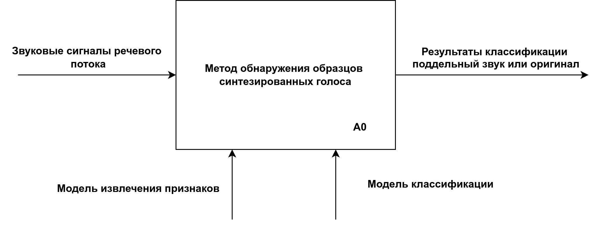
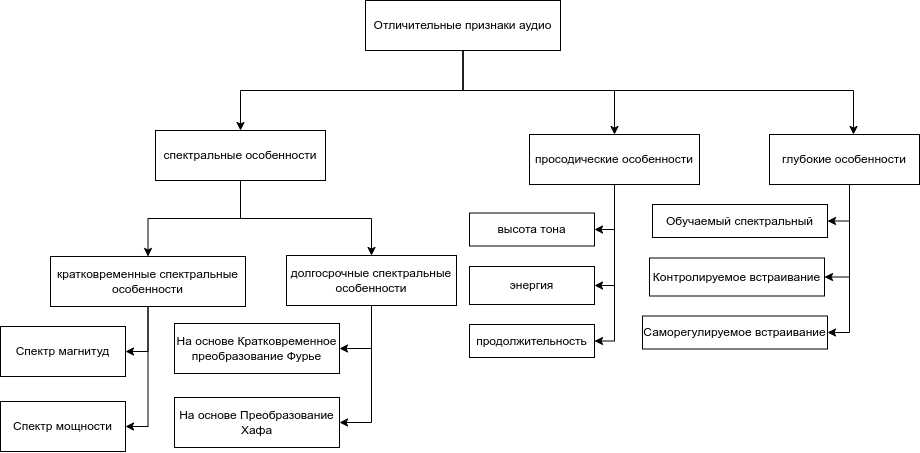

<!-- header: "Московский государственный технический университет
имени Н. Э. Баумана   (национальный исследовательский университет)" -->

## Научная исследовательская работа

 

# «Классификация методов обнаружения образцов голоса, синтезированных с помощью нейронных сетей»

 

### _Студент: Ахмад Халид Каримзай ИУ7и-74Б_

### _Научный руководитель: А.С. Кострицкий_

<!-- МГТУ им.  -->

---

<!-- header: "" -->
<!-- footer: "" -->

## <!-- paginate: true -->

## Цель и задачи работы

**Цель** - В рамках данной научной-исследовательской работы, было расмотрено
следующие цели и задачи:

**Задачи**:

- Синтезирование аудио: Понятие и Типы;
- Характеристики и особенности аудиоматериала для изучения;
- Понятие и схема работы системы обнаружения синтетического звука;
- Классификация и обзор синтезированного звука.

---

## Постановка задачи

---

## Анализ предметной области

Под термином ”Синтезирование голоса” обычно понимается любой аудио-сигнал, важные характеристики которого были изменены при помощи технологий нейронных сетей, сохраняя при этом воспринимаемую естественность, в проведенные исследования в основном выделяли пять видов дипфейкового звука:

- преобразование текста в речь;
- преобразование голоса;
- подделка эмоций;
- подделка сцен;
- частично подделка.

---

 

<table class = "widetab">
    <caption>Классификации аудиодипфейков по способу генерации</caption>
    <tr>
        <th>Поддельный тип</th>
        <th>Поддельная черта</th>
        <th>Поддельная продолжительность</th>
        <th>С помощью нейронной сети</th>
    </tr>
    <tr>
        <td>Преобразование текста в речь</td>
        <td>Личность спикера</td>
        <td>полностью</td>
        <td>да</td>
    </tr>
    <tr>
        <td>Преобразование голоса</td>
        <td>Личность спикера</td>
        <td>полностью</td>
        <td>да</td>
    </tr>
    <tr>
          <td>Подделка эмоций</td>
          <td>эмоция спикера</td>
          <td>полностью</td>
          <td>да</td>
    </tr>
    <tr>
        <td>Подделка сцен</td>
        <td>Акустическая сцена</td>
        <td>полностью</td>
        <td>да</td>
    </tr>
    <tr>
        <td>Частично подделка</td>
        <td>Речевое содержание</td>
        <td>частично</td>
        <td>да</td>
    </tr>
</table>

---

## Классификации аудио по признаками

- Спектральные характеристики;
- Просодические характеристики;
- Глубокие характеристики.

---

## Система обнаружения поддельного звука

1. Сквозная система - в этом варианте система обнаружения поддельного
звука, получает на вход речевой поток;
2. Комбинированная система - в этом варианте система обнаружения
поддельного звука, состоит из двух модулей:
    - Модуль извлечения признаков;
    - Модуль классификации.

Существующие методы:

  1. Метод с гениализацией признаков;

  2. Метод с использованием интегрированного спектрально-временного подхода;

  3. Метод с использованием трансферного обучения.

---

## Критерии сравнения методов

1. Равная частота ошибок (EER):

$$

    P_{\text{ложный}}(\theta) = \frac{\text{количество фальшивых голосов с партитурой} > \theta}{\text{полное количество фальшивых голосов}}

$$

$$

    P_{\text{пропущенный}}(\theta) = \frac{\text{количество настоящих голосов со счетом} \le \theta}{\text{полное количество истинных голосов}}, 

$$

$$

  ERR = P_{\text{ложный}}(\theta) = P_{\text{пропущенный}}(\theta), 

$$

2. Функция затрат на тандемное обнаружение (mint − DCF):

$$

    min t - DCF = \min_{\theta} \{C_{0} + C_{1}P_{\text{пропущенный}}(\theta) + C_{2}P_{\text{ложный}}(\theta)\}, \\

$$

---

## Классификация причисленных методов обнаружения синтетического звука

1. K1 - Точность обнаружение поддельной речи, для этой цели рассматриваем оценка ошибки $\mathrm{ERR}$ относителя корпус данных ASVSpoof, данное значение настолько меньше, настолько выше точность работы метода;
2. К2 - Устойчивость к различным типам поддельной речи, для этой цели рассматриваем оценку функция затрат на тандемное обнаружение \(min t-DCF\) относителя корпус данных ASVSpoof \cite{yamagishi2021asvspoof}, данное значение настолько меньше, настолько выше точность работы метода относительно различных видов синтезирования звука;
3. К3 - Принимает ли на вход аудиосигнал;
4. К4 - Требует ли обучение модель классификации.

---

<table style="width:100%; border-collapse: collapse; text-align: center;">
    <caption>Классификация приведенных методов обнаружения синтетического звука</caption>
    <thead>
        <tr>
            <th style="border: 1px solid black;">Метод</th>
            <th style="border: 1px solid black;">К1</th>
            <th style="border: 1px solid black;">К2</th>
            <th style="border: 1px solid black;">К3</th>
            <th style="border: 1px solid black;">К4</th>
        </tr>
    </thead>
    <tbody>
        <tr>
            <td style="border: 1px solid black; text-align: left;">Метод с генерализацией признаков</td>
            <td style="border: 1px solid black;">4.07%</td>
            <td style="border: 1px solid black;">0.102</td>
            <td style="border: 1px solid black;">Нет</td>
            <td style="border: 1px solid black;">Да</td>
        </tr>
        <tr>
            <td style="border: 1px solid black; text-align: left;">Метод с использованием трансферного обучения</td>
            <td style="border: 1px solid black;">8.09%</td>
            <td style="border: 1px solid black;">0.2116</td>
            <td style="border: 1px solid black;">Нет</td>
            <td style="border: 1px solid black;">Да</td>
        </tr>
        <tr>
            <td style="border: 1px solid black; text-align: left;">Метод с использованием интегрированного спектрально-временного подхода</td>
            <td style="border: 1px solid black;">0.83%</td>
            <td style="border: 1px solid black;">0.0275</td>
            <td style="border: 1px solid black;">Да</td>
            <td style="border: 1px solid black;">Да</td>
        </tr>
    </tbody>
</table>

---

## Заключение

В рамках данной работы было проведено изучение системы обнаружения
аудиодипфейков, анализ предметной области, рассмотрение признаков аудио
для изучения и обучения, а также проведена классификация и обзор методов
обнаружения аудиодипфейков.
В итоге можно описать структуру работы системы обнаружения синтетического звука следующим образом:
1. На вход поступает аудиозапись.
2. Модель извлечения признаков предварительно обрабатывает запись.
3. В некоторых методах модели используют признаки для обучения, а в
некоторых других просто принимают звуковую речь.
4. Модель классификации использует признаки или саму звуковую речь для
обучения и распознавания.