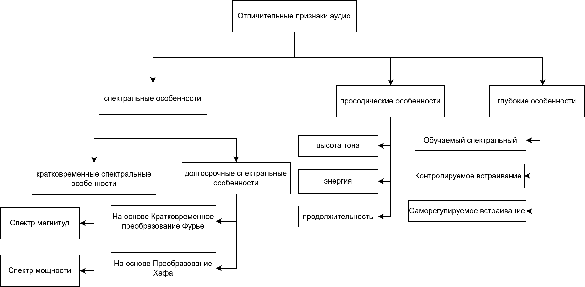

<!-- header: "Московский государственный технический университет
имени Н. Э. Баумана   (национальный исследовательский университет)" -->

## Научная исследовательская работа

 

# «Классификация методов обнаружения образцов голоса, синтезированных с помощью нейронных сетей»

 

### _Студент: Ахмад Халид Каримзай ИУ7и-74Б_

### _Научный руководитель: А.С. Кострицкий_

<!-- МГТУ им.  -->

---

<!-- header: "" -->
<!-- footer: "" -->

## <!-- paginate: true -->

## Цель и задачи работы

**Цель** - В рамках данной научной-исследовательской работы, было расмотрено
следующие цели и задачи:

**Задачи**:

- Синтезирование аудио: Понятие и Типы;
- Характеристики и особенности аудиоматериала для изучения;
- Понятие и схема работы системы обнаружения синтетического звука;
- Классификация и обзор синтезированного звука.

---

## Понятие синтезированого голоса

Под термином ”Синтезирование голоса” обычно понимается любой аудио-сигнал, важные характеристики которого были изменены при помощи технологий нейронных сетей, сохраняя при этом воспринимаемую естественность, в проведенные исследования в основном выделяли пять видов дипфейкового звука:

- преобразование текста в речь;
- преобразование голоса;
- подделка эмоций;
- подделка сцен;
- частично подделка.

---

<table class = "widetab">
    <tr>
        <th>Поддельный тип</th>
        <th>Поддельная черта</th>
        <th>Поддельная продолжительность</th>
        <th>С помощью продолжительность нейронной сети</th>
    </tr>
    <tr>
        <td>Преобразование текста в речь</td>
        <td>Личность спикера</td>
        <td>полностью</td>
        <td>да</td>
    </tr>
    <tr>
        <td>Преобразование голоса</td>
        <td>Личность спикера</td>
        <td>полностью</td>
        <td>да</td>
    </tr>
    <tr>
          <td>Подделка эмоций</td>
          <td>эмоция спикера</td>
          <td>полностью</td>
          <td>да</td>
    </tr>
    <tr>
        <td>Подделка сцен</td>
        <td>Акустическая сцена</td>
        <td>полностью</td>
        <td>да</td>
    </tr>
    <tr>
        <td>Частично подделка</td>
        <td>Речевое содержание</td>
        <td>частично</td>
        <td>да</td>
    </tr>
</table>

---

## Признаки аудио для изучения

Извлечение признаков представляет собой ключевой модуль классификатора аудио-дипфейков. Основной целью этого процесса является изучение характерных особенностей путем выделения акустических артефактов из речевых сигналов, которые могут свидетельствовать о наличии поддельных атак. Большое количество исследований подчеркнуло важность определения полезных признаков для эффективного обнаружения дипфейков.

- Спектральные характеристики;
- Просодические характеристики;
- Глубокие характеристики.

---

## Классификации аудио по признаками

---

## Система обнаружения поддельного звука

Основной задачей системы обнаружения поддельного звука (аудио
дипфейк) является процесс выявления поддельного звука в речевом потоке.
В качестве входных данных используются звуковые сигналы, а на выходе
представляются результаты классификации, система в целом состоить их двух частей:

1. Модуль извлечения признаков.
2. Модуль классификации.

---

## Модуль извлечения признаков

Модуль извлечения признаков должен извлекать соответствующую
информацию из речевого сигнала, отражающую артефакты, связанные с
процессом преобразования или синтеза. В основном, на этом этапе в
большинстве случаев извлекаются спектральные характеристики.

Самые популярные спектральные характеристики, используемые в
системе обнаружения синтезированного звука, являются:

1. Кепстральные коэффициенты мел-частоты (MFCC). 
2. Линейные частотные кепстральные коэффициенты (LFCC).

---

## Модель класификации

В системах, используемых для обнаружения поддельного звука, важным
фактором являются параметрические характеристики аудио для изучения, и
внутренний классификатор играет ключевую роль в глубоком распознавании
аудио, внутренние классификаторы, которые часто используются для
обнаружения аудио-дипфейков, в основном делятся на две категории:

1. Статистические методы.
2. С использованием глубоких нейронных сетей.
---

## Статистические методы обнаружения Аудио Дипфейк

### Машина опорных векторов (SVM)
$$
H_{1} = \{x \in \mathbb{R}^{n} | f_{(x)} > 0\} \\
H_{2} = \{x \in \mathbb{R}^{n} | f_{(x)} < 0\}  
$$

### Гауссовые моделей смеси (GMM)

$$
  f_{i}^{s}(x) = \frac{1}{\sqrt{(2\pi)^{n}|\Sigma_{i}^{s}|}} \exp \left(-\frac{1}{2}(x - \mu_{i}^{s})^T \Sigma_{i}^{s}-1 (x - \mu_{i}^{s})\right)
$$

---

## Методы класификации с применением глубоких нейронных сетей

### Сверточная нейронная сеть (CNN)

---

### Остаточная нейронная сеть (RNN)

---

## Заключение

Обнаружение синтезированного звука - довольно сложная задача, и для успешного решения требуется значительное внимание. Как предложено во многих исследованиях по обнаружению синтетического звука, наилучшим вариантом классификации звука в настоящее время являются глубокие нейронные сети.

Структура работы системы обнаружения синтетического звука может быть описана следующим образом:

- На вход поступает аудиозапись.
- Модель извлечения признаков предварительно обрабатывает запись.
- Затем происходит процесс извлечения признаков.
- Модель классификации использует эти признаки для обучения и распознавания.

